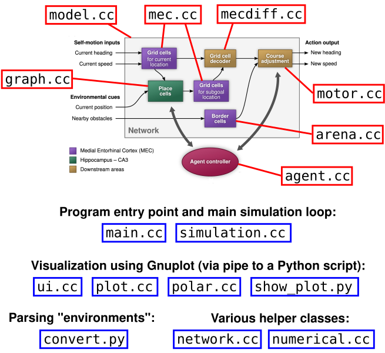

Navigating with grid and place cells in cluttered environments
==============================================================

This code implements the combined grid and place cell-based navigation
model presented in the paper [Edvardsen et al. (2020)](https://onlinelibrary.wiley.com/doi/full/10.1002/hipo.23147):

> Edvardsen, Vegard, Bicanski, Andrej, & Burgess, Neil (2020).
> [Navigating with grid and place cells in cluttered environments](https://onlinelibrary.wiley.com/doi/full/10.1002/hipo.23147).
> _Hippocampus_, 30(3), 220-232.

Setting up
----------

The code has been verified to run on Ubuntu 20.04.4 LTS.

- Install dependencies:
  - `sudo apt install build-essential gnuplot libboost-dev python-pil.imagetk`
- Build the simulation program (`ratnav`):
  - `make`
- Create a FIFO pipe that will be used to connect the simulator to the visualization UI:
  - `mkfifo plot_pipe`

Simulation environments
-----------------------

The simulation program (`ratnav`) needs an _environment script_ in order to
run. The environment script defines the polygons of the obstacles in the
environment, describes the agent's initial location, controls the agent's
outbound exploration path, and indicates which goal the agent should seek to
return to. The various environment scripts are contained in `environments/*.txt`.

The environment scripts rely on SVG files to define the obstacle polygons and
trajectory paths. Before the environments can be used by the `ratnav` program,
they must therefore be _preprocessed_ by the `convert.py` script. This script
parses through the environment script (`.txt`), and whenever it encounters a
reference to an SVG file, replaces that part of the command stream in the
script file with the corresponding polygons/paths extracted from the SVG file.

The simulation program `ratnav` expects to receive the final, preprocessed
environment script on its standard input (`stdin`) stream. The easiest way to
run the simulator is thus to run `convert.py` and pipe its `stdout` output
directly into the `stdin` input of `ratnav` (see below).

Running the simulation
----------------------

The following commands show how to run the simulator while _visualizing_ the
live simulation state in a separate window alongside the simulation terminal.

In order to enable this, the simulation program `ratnav` will regularly send
rendering/plotting commands to the FIFO pipe `plot_pipe`. In order for this
live visualization/"live plot" functionality to work as expected, you need to
run the visualization GUI script script `show_plot.py` in a concurrent process.
The `show_plot.py` script can then read the Gnuplot commands out from the FIFO
pipe, forward them to a Gnuplot subprocess, and finally render the results into
a GUI window.

The following commands show how to do this:

- In terminal window 1, start the visualization UI:
  - `./show_plot.py`
- In terminal window 2, run the simulator:
  - `./convert.py environments/deflect_demo.txt | ./ratnav --modules=12 --agent=combined --live-plot`

Code overview
-------------

The following figure gives an overview of the code files and how they relate to
the major parts of the model (as presented in Fig. 1C in the paper).

_(Overview of code files, based on Fig. 1C from Edvardsen et al. (2020), CC BY 4.0)_

License
-------

Licensed under the EUPL-1.2-or-later.

Copyright (c) 2019 NTNU - Norwegian University of Science and Technology.

Author: Vegard Edvardsen (https://github.com/evegard).
